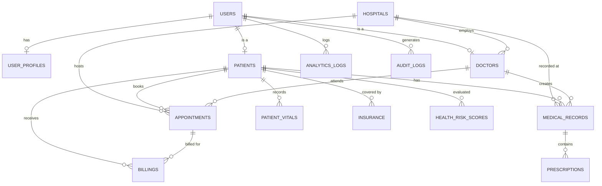

# 🏥 Healthcare Analytics - Complete Database Schema

> **Database&nbsp;:** `healthcare_analytics`
> **Engine&nbsp;&nbsp;:** MySQL
> **Tables&nbsp;&nbsp;:** 15

---

## 📑 Table of Contents

| # | Section | Tables |
|---|---------|--------|
| 1 | [Create Database](#step-1--create-database) | — |
| 2 | [Core Tables](#step-2--core-tables) | `users`, `hospitals` |
| 3 | [User-Related Tables](#step-3--user-related-tables) | `user_profiles`, `patients`, `doctors` |
| 4 | [Appointments Module](#step-4--appointments-module) | `appointments` |
| 5 | [Medical Data Tables](#step-5--medical-data-tables) | `patient_vitals`, `medical_records`, `prescriptions` |
| 6 | [Lab Tests](#step-6--lab-tests) | `lab_tests` |
| 7 | [Billing & Insurance](#step-7--billing--insurance) | `billings`, `insurance` |
| 8 | [Analytics & AI Tables](#step-8--analytics--ai-tables) | `health_risk_scores`, `analytics_logs` |
| 9 | [Audit Logs (Admin)](#step-9--audit-logs-admin) | `audit_logs` |
| ✅ | [Final Verification](#-final-verification) | — |

---

## 🗃️ Entity-Relationship Overview



---

## Step 1 — Create Database

```sql
-- ============================================================
-- 🏥 HEALTHCARE ANALYTICS DATABASE
-- Purpose : Central database for managing hospital operations,
--           patient records, billing, lab diagnostics, and
--           AI-driven health analytics.
-- ============================================================

CREATE DATABASE healthcare_analytics;   -- Create the main database
USE healthcare_analytics;               -- Switch to it for all subsequent queries
```

---

## Step 2 — Core Tables

> These tables have **no foreign keys** and must be created first.

### 2.1 `users`

| Column | Type | Constraints |
|--------|------|-------------|
| `user_id` | `INT` | `AUTO_INCREMENT`, **PRIMARY KEY** |
| `username` | `VARCHAR(100)` | `UNIQUE`, `NOT NULL` |
| `password` | `VARCHAR(255)` | `NOT NULL` |
| `email` | `VARCHAR(255)` | `UNIQUE`, `NOT NULL` |
| `role` | `ENUM('admin','doctor','patient','analyst')` | `NOT NULL` |
| `created_on` | `DATETIME` | `DEFAULT CURRENT_TIMESTAMP` |

```sql
-- ────────────────────────────────────────────────────────────
-- TABLE: users
-- Purpose : Stores login credentials and role info for every
--           person who accesses the system (admins, doctors,
--           patients, and data analysts).
-- Note    : This is the root table — most other tables
--           reference it via foreign keys.
-- ────────────────────────────────────────────────────────────

CREATE TABLE users (
    user_id    INT AUTO_INCREMENT PRIMARY KEY,               -- Unique identifier for each user
    username   VARCHAR(100) UNIQUE NOT NULL,                 -- Login username (must be unique)
    password   VARCHAR(255) NOT NULL,                        -- Hashed password (never plain text)
    email      VARCHAR(255) UNIQUE NOT NULL,                 -- Email address (must be unique)
    role       ENUM('admin', 'doctor', 'patient', 'analyst') NOT NULL,  -- Access-control role
    created_on DATETIME DEFAULT CURRENT_TIMESTAMP            -- Account creation timestamp
);
```

---

### 2.2 `hospitals`

| Column | Type | Constraints |
|--------|------|-------------|
| `hospital_id` | `INT` | `AUTO_INCREMENT`, **PRIMARY KEY** |
| `name` | `VARCHAR(255)` | `NOT NULL` |
| `location` | `VARCHAR(255)` | — |
| `contact_info` | `VARCHAR(255)` | — |

```sql
-- ────────────────────────────────────────────────────────────
-- TABLE: hospitals
-- Purpose : Master list of hospitals / healthcare facilities.
--           Doctors, appointments, and medical records are
--           linked to a hospital via foreign key.
-- ────────────────────────────────────────────────────────────

CREATE TABLE hospitals (
    hospital_id  INT AUTO_INCREMENT PRIMARY KEY,             -- Unique hospital identifier
    name         VARCHAR(255) NOT NULL,                      -- Official hospital name
    location     VARCHAR(255),                               -- Address / location of the hospital
    contact_info VARCHAR(255)                                -- Phone, email, or other contact details
);
```

---

## Step 3 — User-Related Tables

### 3.1 `user_profiles`

| Column | Type | Constraints |
|--------|------|-------------|
| `profile_id` | `INT` | `AUTO_INCREMENT`, **PRIMARY KEY** |
| `user_id` | `INT` | `NOT NULL`, **FK → `users`** |
| `first_name` | `VARCHAR(100)` | — |
| `last_name` | `VARCHAR(100)` | — |
| `date_of_birth` | `DATE` | — |
| `contact_number` | `VARCHAR(20)` | — |
| `address` | `TEXT` | — |

```sql
-- ────────────────────────────────────────────────────────────
-- TABLE: user_profiles
-- Purpose : Extended personal details for any user.
--           Separated from `users` to keep auth data lean.
-- On Delete: CASCADE — deleting a user removes their profile.
-- ────────────────────────────────────────────────────────────

CREATE TABLE user_profiles (
    profile_id     INT AUTO_INCREMENT PRIMARY KEY,           -- Profile record ID
    user_id        INT NOT NULL,                             -- FK → users (one-to-one)
    first_name     VARCHAR(100),                             -- User's first name
    last_name      VARCHAR(100),                             -- User's last name
    date_of_birth  DATE,                                     -- User's date of birth
    contact_number VARCHAR(20),                              -- Contact phone number
    address        TEXT,                                     -- Full mailing / residential address
    FOREIGN KEY (user_id) REFERENCES users(user_id)
        ON DELETE CASCADE                                    -- Auto-remove profile when user is deleted
);
```

---

### 3.2 `patients`

| Column | Type | Constraints |
|--------|------|-------------|
| `patient_id` | `INT` | `AUTO_INCREMENT`, **PRIMARY KEY** |
| `user_id` | `INT` | `NOT NULL`, **FK → `users`** |
| `gender` | `VARCHAR(10)` | — |
| `blood_group` | `VARCHAR(10)` | — |
| `emergency_contact` | `VARCHAR(20)` | — |

```sql
-- ────────────────────────────────────────────────────────────
-- TABLE: patients
-- Purpose : Medical identity of a user who is a patient.
--           Holds health-specific data (gender, blood group,
--           emergency contact).
-- On Delete: CASCADE — removing the user removes patient data.
-- ────────────────────────────────────────────────────────────

CREATE TABLE patients (
    patient_id        INT AUTO_INCREMENT PRIMARY KEY,        -- Unique patient identifier
    user_id           INT NOT NULL,                          -- FK → users (links patient to login account)
    gender            VARCHAR(10),                           -- e.g. Male, Female, Other
    blood_group       VARCHAR(10),                           -- e.g. A+, B-, O+, AB+
    emergency_contact VARCHAR(20),                           -- Emergency contact phone number
    FOREIGN KEY (user_id) REFERENCES users(user_id)
        ON DELETE CASCADE                                    -- Cascade delete with user account
);
```

---

### 3.3 `doctors`

| Column | Type | Constraints |
|--------|------|-------------|
| `doctor_id` | `INT` | `AUTO_INCREMENT`, **PRIMARY KEY** |
| `user_id` | `INT` | `NOT NULL`, **FK → `users`** |
| `hospital_id` | `INT` | **FK → `hospitals`** |
| `specialization` | `VARCHAR(100)` | — |
| `license_number` | `VARCHAR(50)` | `UNIQUE` |

```sql
-- ────────────────────────────────────────────────────────────
-- TABLE: doctors
-- Purpose : Professional details of users who are doctors.
--           Each doctor is optionally linked to a hospital.
-- FKs     : user_id     → users      (CASCADE on delete)
--           hospital_id → hospitals
-- ────────────────────────────────────────────────────────────

CREATE TABLE doctors (
    doctor_id      INT AUTO_INCREMENT PRIMARY KEY,           -- Unique doctor identifier
    user_id        INT NOT NULL,                             -- FK → users (links doctor to login account)
    hospital_id    INT,                                      -- FK → hospitals (where the doctor practices)
    specialization VARCHAR(100),                             -- e.g. Cardiology, Neurology
    license_number VARCHAR(50) UNIQUE,                       -- Medical license (must be unique)
    FOREIGN KEY (user_id) REFERENCES users(user_id)
        ON DELETE CASCADE,                                   -- Remove doctor record if user is deleted
    FOREIGN KEY (hospital_id) REFERENCES hospitals(hospital_id)  -- Links to the hospital master table
);
```

---

## Step 4 — Appointments Module

### `appointments`

| Column | Type | Constraints |
|--------|------|-------------|
| `appointment_id` | `INT` | `AUTO_INCREMENT`, **PRIMARY KEY** |
| `patient_id` | `INT` | `NOT NULL`, **FK → `patients`** |
| `doctor_id` | `INT` | `NOT NULL`, **FK → `doctors`** |
| `hospital_id` | `INT` | **FK → `hospitals`** |
| `appointment_date` | `DATE` | — |
| `status` | `ENUM('scheduled','completed','cancelled')` | — |
| `reason` | `TEXT` | — |

```sql
-- ────────────────────────────────────────────────────────────
-- TABLE: appointments
-- Purpose : Tracks scheduled, completed, and cancelled
--           visits between a patient and a doctor at a hospital.
-- FKs     : patient_id  → patients
--           doctor_id   → doctors
--           hospital_id → hospitals
-- ────────────────────────────────────────────────────────────

CREATE TABLE appointments (
    appointment_id   INT AUTO_INCREMENT PRIMARY KEY,         -- Unique appointment ID
    patient_id       INT NOT NULL,                           -- FK → patients (who booked the visit)
    doctor_id        INT NOT NULL,                           -- FK → doctors  (assigned physician)
    hospital_id      INT,                                    -- FK → hospitals (where the visit takes place)
    appointment_date DATE,                                   -- Date of the appointment
    status           ENUM('scheduled', 'completed', 'cancelled'),  -- Current appointment status
    reason           TEXT,                                   -- Reason for the appointment
    FOREIGN KEY (patient_id) REFERENCES patients(patient_id),      -- Links to patient record
    FOREIGN KEY (doctor_id) REFERENCES doctors(doctor_id),         -- Links to doctor record
    FOREIGN KEY (hospital_id) REFERENCES hospitals(hospital_id)    -- Links to hospital
);
```

---

## Step 5 — Medical Data Tables

### 5.1 `patient_vitals`

| Column | Type | Constraints |
|--------|------|-------------|
| `vital_id` | `INT` | `AUTO_INCREMENT`, **PRIMARY KEY** |
| `patient_id` | `INT` | `NOT NULL`, **FK → `patients`** |
| `recorded_at` | `DATETIME` | `DEFAULT CURRENT_TIMESTAMP` |
| `heart_rate` | `INT` | — |
| `bp_systolic` | `INT` | — |
| `bp_diastolic` | `INT` | — |
| `temperature` | `FLOAT` | — |
| `respiratory_rate` | `INT` | — |

```sql
-- ────────────────────────────────────────────────────────────
-- TABLE: patient_vitals
-- Purpose : Time-series health readings captured during
--           check-ups or IoT device syncs.
-- FK      : patient_id → patients
-- ────────────────────────────────────────────────────────────

CREATE TABLE patient_vitals (
    vital_id         INT AUTO_INCREMENT PRIMARY KEY,         -- Unique reading ID
    patient_id       INT NOT NULL,                           -- FK → patients (whose vitals these are)
    recorded_at      DATETIME DEFAULT CURRENT_TIMESTAMP,     -- When the reading was taken
    heart_rate       INT,                                    -- Beats per minute (BPM)
    bp_systolic      INT,                                    -- Systolic blood pressure (mmHg)
    bp_diastolic     INT,                                    -- Diastolic blood pressure (mmHg)
    temperature      FLOAT,                                  -- Body temperature in °F or °C
    respiratory_rate INT,                                    -- Breaths per minute
    FOREIGN KEY (patient_id) REFERENCES patients(patient_id) -- Links to the patient
);
```

---

### 5.2 `medical_records`

| Column | Type | Constraints |
|--------|------|-------------|
| `record_id` | `INT` | `AUTO_INCREMENT`, **PRIMARY KEY** |
| `patient_id` | `INT` | `NOT NULL`, **FK → `patients`** |
| `doctor_id` | `INT` | `NOT NULL`, **FK → `doctors`** |
| `hospital_id` | `INT` | **FK → `hospitals`** |
| `visit_date` | `DATE` | — |
| `diagnosis` | `TEXT` | — |
| `treatment_plan` | `TEXT` | — |

```sql
-- ────────────────────────────────────────────────────────────
-- TABLE: medical_records
-- Purpose : Core clinical records — each row represents one
--           visit / consultation where a doctor diagnosed
--           a patient and outlined a treatment plan.
-- FKs     : patient_id  → patients
--           doctor_id   → doctors
--           hospital_id → hospitals
-- ────────────────────────────────────────────────────────────

CREATE TABLE medical_records (
    record_id      INT AUTO_INCREMENT PRIMARY KEY,           -- Unique record ID
    patient_id     INT NOT NULL,                             -- FK → patients (who was examined)
    doctor_id      INT NOT NULL,                             -- FK → doctors  (who examined)
    hospital_id    INT,                                      -- FK → hospitals (where the visit took place)
    visit_date     DATE,                                     -- Date of the consultation / visit
    diagnosis      TEXT,                                     -- Doctor's diagnosis summary
    treatment_plan TEXT,                                     -- Prescribed treatment & follow-up plan
    FOREIGN KEY (patient_id) REFERENCES patients(patient_id),
    FOREIGN KEY (doctor_id) REFERENCES doctors(doctor_id),
    FOREIGN KEY (hospital_id) REFERENCES hospitals(hospital_id)
);
```

---

### 5.3 `prescriptions`

| Column | Type | Constraints |
|--------|------|-------------|
| `prescription_id` | `INT` | `AUTO_INCREMENT`, **PRIMARY KEY** |
| `record_id` | `INT` | `NOT NULL`, **FK → `medical_records`** |
| `medication_name` | `VARCHAR(255)` | — |
| `dosage` | `VARCHAR(100)` | — |
| `frequency` | `VARCHAR(100)` | — |
| `start_date` | `DATE` | — |
| `end_date` | `DATE` | — |

```sql
-- ────────────────────────────────────────────────────────────
-- TABLE: prescriptions
-- Purpose : Medicines prescribed as part of a medical record.
--           One medical_record can have multiple prescriptions.
-- On Delete: CASCADE — if the parent record is deleted,
--           all associated prescriptions are removed too.
-- ────────────────────────────────────────────────────────────

CREATE TABLE prescriptions (
    prescription_id INT AUTO_INCREMENT PRIMARY KEY,          -- Unique prescription ID
    record_id       INT NOT NULL,                            -- FK → medical_records (parent consultation)
    medication_name VARCHAR(255),                            -- Name of the prescribed medication
    dosage          VARCHAR(100),                            -- e.g. "500mg"
    frequency       VARCHAR(100),                            -- e.g. "twice daily", "every 8 hours"
    start_date      DATE,                                    -- When to start taking the medication
    end_date        DATE,                                    -- When to stop taking the medication
    FOREIGN KEY (record_id) REFERENCES medical_records(record_id)
        ON DELETE CASCADE                                    -- Auto-remove if medical record is deleted
);
```

---

## Step 6 — Lab Tests

### `lab_tests`

| Column | Type | Constraints |
|--------|------|-------------|
| `test_id` | `INT` | `AUTO_INCREMENT`, **PRIMARY KEY** |
| `test_name` | `VARCHAR(255)` | `NOT NULL` |
| `description` | `TEXT` | — |
| `std_range_min` | `FLOAT` | — |
| `std_range_max` | `FLOAT` | — |

```sql
-- ────────────────────────────────────────────────────────────
-- TABLE: lab_tests
-- Purpose : Reference / catalog table of available laboratory
--           tests (e.g. CBC, Lipid Panel, Blood Sugar).
--           Stores standard reference ranges for each test.
-- Note    : This is a standalone lookup table with no FKs.
-- ────────────────────────────────────────────────────────────

CREATE TABLE lab_tests (
    test_id       INT AUTO_INCREMENT PRIMARY KEY,            -- Unique test ID
    test_name     VARCHAR(255) NOT NULL,                     -- e.g. "Complete Blood Count (CBC)"
    description   TEXT,                                      -- Detailed description of the test
    std_range_min FLOAT,                                     -- Standard minimum reference value
    std_range_max FLOAT                                      -- Standard maximum reference value
);
```

---

## Step 7 — Billing & Insurance

### 7.1 `billings`

| Column | Type | Constraints |
|--------|------|-------------|
| `bill_id` | `INT` | `AUTO_INCREMENT`, **PRIMARY KEY** |
| `appointment_id` | `INT` | `NOT NULL`, **FK → `appointments`** |
| `patient_id` | `INT` | `NOT NULL`, **FK → `patients`** |
| `amount` | `FLOAT` | — |
| `payment_status` | `ENUM('paid','unpaid','pending')` | — |
| `generated_at` | `DATETIME` | `DEFAULT CURRENT_TIMESTAMP` |

```sql
-- ────────────────────────────────────────────────────────────
-- TABLE: billings
-- Purpose : Financial record for each appointment.
--           Tracks how much is owed and payment status.
-- FKs     : appointment_id → appointments
--           patient_id     → patients
-- ────────────────────────────────────────────────────────────

CREATE TABLE billings (
    bill_id        INT AUTO_INCREMENT PRIMARY KEY,           -- Unique bill ID
    appointment_id INT NOT NULL,                             -- FK → appointments (what visit this is for)
    patient_id     INT NOT NULL,                             -- FK → patients (who is being billed)
    amount         FLOAT,                                    -- Total bill amount (in local currency)
    payment_status ENUM('paid', 'unpaid', 'pending'),        -- Current payment state
    generated_at   DATETIME DEFAULT CURRENT_TIMESTAMP,       -- When the bill was generated
    FOREIGN KEY (appointment_id) REFERENCES appointments(appointment_id),
    FOREIGN KEY (patient_id) REFERENCES patients(patient_id)
);
```

---

### 7.2 `insurance`

| Column | Type | Constraints |
|--------|------|-------------|
| `insurance_id` | `INT` | `AUTO_INCREMENT`, **PRIMARY KEY** |
| `patient_id` | `INT` | `NOT NULL`, **FK → `patients`** |
| `provider_name` | `VARCHAR(255)` | — |
| `policy_number` | `VARCHAR(100)` | — |
| `coverage_details` | `TEXT` | — |
| `expiry_date` | `DATE` | — |

```sql
-- ────────────────────────────────────────────────────────────
-- TABLE: insurance
-- Purpose : Insurance policy details linked to a patient.
--           Used to determine coverage for billing.
-- FK      : patient_id → patients
-- ────────────────────────────────────────────────────────────

CREATE TABLE insurance (
    insurance_id     INT AUTO_INCREMENT PRIMARY KEY,         -- Unique insurance record ID
    patient_id       INT NOT NULL,                           -- FK → patients (policy holder)
    provider_name    VARCHAR(255),                           -- Insurance company name
    policy_number    VARCHAR(100),                           -- Policy / member ID
    coverage_details TEXT,                                   -- Details of what is covered
    expiry_date      DATE,                                   -- Policy expiry date
    FOREIGN KEY (patient_id) REFERENCES patients(patient_id) -- Links to the patient
);
```

---

## Step 8 — Analytics & AI Tables

### 8.1 `health_risk_scores`

| Column | Type | Constraints |
|--------|------|-------------|
| `score_id` | `INT` | `AUTO_INCREMENT`, **PRIMARY KEY** |
| `patient_id` | `INT` | `NOT NULL`, **FK → `patients`** |
| `calculated_at` | `DATETIME` | `DEFAULT CURRENT_TIMESTAMP` |
| `risk_model` | `VARCHAR(255)` | — |
| `score_value` | `FLOAT` | — |
| `risk_level` | `VARCHAR(50)` | — |

```sql
-- ────────────────────────────────────────────────────────────
-- TABLE: health_risk_scores
-- Purpose : AI/ML-generated risk assessments for patients.
--           e.g. "Diabetes Risk = 0.73" — used by analysts
--           and doctors for preventive care decisions.
-- FK      : patient_id → patients
-- ────────────────────────────────────────────────────────────

CREATE TABLE health_risk_scores (
    score_id      INT AUTO_INCREMENT PRIMARY KEY,            -- Unique risk score record ID
    patient_id    INT NOT NULL,                              -- FK → patients (who was evaluated)
    calculated_at DATETIME DEFAULT CURRENT_TIMESTAMP,        -- When the score was calculated
    risk_model    VARCHAR(255),                              -- e.g. "XGBoost v2.1", "Logistic Regression"
    score_value   FLOAT,                                     -- Computed risk score (e.g. 0.0 – 1.0)
    risk_level    VARCHAR(50),                               -- e.g. "Low", "Medium", "High", "Critical"
    FOREIGN KEY (patient_id) REFERENCES patients(patient_id) -- Links to the patient
);
```

---

### 8.2 `analytics_logs`

| Column | Type | Constraints |
|--------|------|-------------|
| `log_id` | `INT` | `AUTO_INCREMENT`, **PRIMARY KEY** |
| `user_id` | `INT` | `NOT NULL`, **FK → `users`** |
| `action_type` | `VARCHAR(255)` | — |
| `entity_affected` | `VARCHAR(255)` | — |
| `timestamp` | `DATETIME` | `DEFAULT CURRENT_TIMESTAMP` |
| `details` | `TEXT` | — |

```sql
-- ────────────────────────────────────────────────────────────
-- TABLE: analytics_logs
-- Purpose : Tracks analytics actions performed by users —
--           useful for reproducibility, debugging models,
--           and compliance.
-- FK      : user_id → users
-- ────────────────────────────────────────────────────────────

CREATE TABLE analytics_logs (
    log_id          INT AUTO_INCREMENT PRIMARY KEY,          -- Unique log entry ID
    user_id         INT NOT NULL,                            -- FK → users (who performed the action)
    action_type     VARCHAR(255),                            -- e.g. "Risk Prediction", "Report Generation"
    entity_affected VARCHAR(255),                            -- e.g. "patients", "medical_records"
    timestamp       DATETIME DEFAULT CURRENT_TIMESTAMP,      -- When the action was performed
    details         TEXT,                                    -- Additional details about the action
    FOREIGN KEY (user_id) REFERENCES users(user_id)          -- Links to the user
);
```

---

## Step 9 — Audit Logs (Admin)

### `audit_logs`

| Column | Type | Constraints |
|--------|------|-------------|
| `audit_id` | `INT` | `AUTO_INCREMENT`, **PRIMARY KEY** |
| `user_id` | `INT` | `NOT NULL`, **FK → `users`** |
| `table_name` | `VARCHAR(100)` | — |
| `record_id` | `INT` | — |
| `action` | `VARCHAR(255)` | — |
| `old_value` | `TEXT` | — |
| `new_value` | `TEXT` | — |
| `timestamp` | `DATETIME` | `DEFAULT CURRENT_TIMESTAMP` |

```sql
-- ────────────────────────────────────────────────────────────
-- TABLE: audit_logs
-- Purpose : Security & compliance log — records every
--           significant action (INSERT, UPDATE, DELETE)
--           performed by any user in the system.
--           Stores old and new values for change tracking.
-- FK      : user_id → users
-- ────────────────────────────────────────────────────────────

CREATE TABLE audit_logs (
    audit_id    INT AUTO_INCREMENT PRIMARY KEY,              -- Unique audit log entry ID
    user_id     INT NOT NULL,                                -- FK → users (who performed the action)
    table_name  VARCHAR(100),                                -- Which table was affected
    record_id   INT,                                         -- ID of the affected record
    action      VARCHAR(255),                                -- e.g. "INSERT", "UPDATE", "DELETE"
    old_value   TEXT,                                        -- Previous value (for UPDATE / DELETE)
    new_value   TEXT,                                        -- New value (for INSERT / UPDATE)
    timestamp   DATETIME DEFAULT CURRENT_TIMESTAMP,          -- When the action occurred
    FOREIGN KEY (user_id) REFERENCES users(user_id)          -- Links to the acting user
);
```

---

## ✅ Final Verification

Run the following query to confirm all **15 tables** were created successfully:

```sql
-- Quick verification query — should return exactly 15 table names
SHOW TABLES;
```

**Expected output — 15 tables:**

| # | Table Name |
|---|------------|
| 1 | `analytics_logs` |
| 2 | `appointments` |
| 3 | `audit_logs` |
| 4 | `billings` |
| 5 | `doctors` |
| 6 | `health_risk_scores` |
| 7 | `hospitals` |
| 8 | `insurance` |
| 9 | `lab_tests` |
| 10 | `medical_records` |
| 11 | `patient_vitals` |
| 12 | `patients` |
| 13 | `prescriptions` |
| 14 | `user_profiles` |
| 15 | `users` |

---

> **✨ Schema created successfully — You're all set!**
