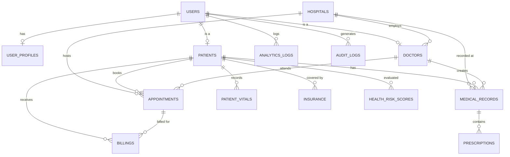

# 🏥 Healthcare Analytics - Complete Database Schema

## 📑 Table of Contents

| # | Section | Tables |
|---|---------|--------|
| 1 | [Create Database](#step-1--create-database) | — |
| 2 | [Core Tables](#step-2--core-tables) | `users`, `hospitals` |
| 3 | [User-Related Tables](#step-3--user-related-tables) | `user_profiles`, `patients`, `doctors` |
| 4 | [Appointments Module](#step-4--appointments-module) | `appointments` |
| 5 | [Medical Data Tables](#step-5--medical-data-tables) | `patient_vitals`, `medical_records`, `prescriptions` |
| 6 | [Lab Tests](#step-6--lab-tests) | `lab_tests` |
| 7 | [Billing & Insurance](#step-7--billing--insurance) | `billings`, `insurance` |
| 8 | [Analytics & AI Tables](#step-8--analytics--ai-tables) | `health_risk_scores`, `analytics_logs` |
| 9 | [Audit Logs (Admin)](#step-9--audit-logs-admin) | `audit_logs` |
| ✅ | [Final Verification](#-final-verification) | — |

---

## 🗃️ Entity-Relationship Overview



---

## Step 1 - Create Database

```sql
CREATE DATABASE healthcare_analytics;
USE healthcare_analytics;
```
---
## Step 2 - Core Tables

>  Note:- These tables have **no foreign keys** and must be created first.

### 2.1 `users`

| Column | Type | Constraints |
|--------|------|-------------|
| `user_id` | `INT` | `AUTO_INCREMENT`, **PRIMARY KEY** |
| `username` | `VARCHAR(100)` | `UNIQUE`, `NOT NULL` |
| `password` | `VARCHAR(255)` | `NOT NULL` |
| `email` | `VARCHAR(255)` | `UNIQUE`, `NOT NULL` |
| `role` | `ENUM('admin','doctor','patient','analyst')` | `NOT NULL` |
| `created_on` | `DATETIME` | `DEFAULT CURRENT_TIMESTAMP` |

```sql
CREATE TABLE users (
    user_id    INT AUTO_INCREMENT PRIMARY KEY,               
    username   VARCHAR(100) UNIQUE NOT NULL,                 
    password   VARCHAR(255) NOT NULL,                        
    email      VARCHAR(255) UNIQUE NOT NULL,                 
    role       ENUM('admin', 'doctor', 'patient', 'analyst') NOT NULL,  
    created_on DATETIME DEFAULT CURRENT_TIMESTAMP            
);
```

---

### 2.2 `hospitals`

| Column | Type | Constraints |
|--------|------|-------------|
| `hospital_id` | `INT` | `AUTO_INCREMENT`, **PRIMARY KEY** |
| `name` | `VARCHAR(255)` | `NOT NULL` |
| `location` | `VARCHAR(255)` | — |
| `contact_info` | `VARCHAR(255)` | — |

```sql
CREATE TABLE hospitals (
    hospital_id  INT AUTO_INCREMENT PRIMARY KEY,            
    name         VARCHAR(255) NOT NULL,                  
    location     VARCHAR(255),                              
    contact_info VARCHAR(255) 
);
```

---

## Step 3 - User-Related Tables

### 3.1 `user_profiles`

| Column | Type | Constraints |
|--------|------|-------------|
| `profile_id` | `INT` | `AUTO_INCREMENT`, **PRIMARY KEY** |
| `user_id` | `INT` | `NOT NULL`, **FK → `users`** |
| `first_name` | `VARCHAR(100)` | — |
| `last_name` | `VARCHAR(100)` | — |
| `date_of_birth` | `DATE` | — |
| `contact_number` | `VARCHAR(20)` | — |
| `address` | `TEXT` | — |

```sql
CREATE TABLE user_profiles (
    profile_id     INT AUTO_INCREMENT PRIMARY KEY,         
    user_id        INT NOT NULL,                             
    first_name     VARCHAR(100),                             
    last_name      VARCHAR(100),                       
    date_of_birth  DATE,                                  
    contact_number VARCHAR(20),                             
    address        TEXT,                                     
    FOREIGN KEY (user_id) REFERENCES users(user_id)
        ON DELETE CASCADE                              
);
```

---

### 3.2 `patients`

| Column | Type | Constraints |
|--------|------|-------------|
| `patient_id` | `INT` | `AUTO_INCREMENT`, **PRIMARY KEY** |
| `user_id` | `INT` | `NOT NULL`, **FK → `users`** |
| `gender` | `VARCHAR(10)` | — |
| `blood_group` | `VARCHAR(10)` | — |
| `emergency_contact` | `VARCHAR(20)` | — |

```sql
CREATE TABLE patients (
    patient_id        INT AUTO_INCREMENT PRIMARY KEY,        
    user_id           INT NOT NULL,                         
    gender            VARCHAR(10),                           
    blood_group       VARCHAR(10),                           
    emergency_contact VARCHAR(20),                          
    FOREIGN KEY (user_id) REFERENCES users(user_id)
        ON DELETE CASCADE                                  
);
```

---

### 3.3 `doctors`

| Column | Type | Constraints |
|--------|------|-------------|
| `doctor_id` | `INT` | `AUTO_INCREMENT`, **PRIMARY KEY** |
| `user_id` | `INT` | `NOT NULL`, **FK → `users`** |
| `hospital_id` | `INT` | **FK → `hospitals`** |
| `specialization` | `VARCHAR(100)` | — |
| `license_number` | `VARCHAR(50)` | `UNIQUE` |

```sql
CREATE TABLE doctors (
    doctor_id      INT AUTO_INCREMENT PRIMARY KEY,       
    user_id        INT NOT NULL,                             
    hospital_id    INT,                                     
    specialization VARCHAR(100),                          
    license_number VARCHAR(50) UNIQUE,                      
    FOREIGN KEY (user_id) REFERENCES users(user_id)
        ON DELETE CASCADE,                                  
    FOREIGN KEY (hospital_id) REFERENCES hospitals(hospital_id) 
);
```

---

## Step 4 - Appointments Module

### `appointments`

| Column | Type | Constraints |
|--------|------|-------------|
| `appointment_id` | `INT` | `AUTO_INCREMENT`, **PRIMARY KEY** |
| `patient_id` | `INT` | `NOT NULL`, **FK → `patients`** |
| `doctor_id` | `INT` | `NOT NULL`, **FK → `doctors`** |
| `hospital_id` | `INT` | **FK → `hospitals`** |
| `appointment_date` | `DATE` | — |
| `status` | `ENUM('scheduled','completed','cancelled')` | — |
| `reason` | `TEXT` | — |

```sql
CREATE TABLE appointments (
    appointment_id   INT AUTO_INCREMENT PRIMARY KEY,       
    patient_id       INT NOT NULL,                          
    doctor_id        INT NOT NULL,                           
    hospital_id      INT,                                    
    appointment_date DATE,                                 
    status           ENUM('scheduled', 'completed', 'cancelled'),
    reason           TEXT,                                  
    FOREIGN KEY (patient_id) REFERENCES patients(patient_id),    
    FOREIGN KEY (doctor_id) REFERENCES doctors(doctor_id),        
    FOREIGN KEY (hospital_id) REFERENCES hospitals(hospital_id)
);
```

---

## Step 5 - Medical Data Tables

### 5.1 `patient_vitals`

| Column | Type | Constraints |
|--------|------|-------------|
| `vital_id` | `INT` | `AUTO_INCREMENT`, **PRIMARY KEY** |
| `patient_id` | `INT` | `NOT NULL`, **FK → `patients`** |
| `recorded_at` | `DATETIME` | `DEFAULT CURRENT_TIMESTAMP` |
| `heart_rate` | `INT` | — |
| `bp_systolic` | `INT` | — |
| `bp_diastolic` | `INT` | — |
| `temperature` | `FLOAT` | — |
| `respiratory_rate` | `INT` | — |

```sql
CREATE TABLE patient_vitals (
    vital_id         INT AUTO_INCREMENT PRIMARY KEY,         
    patient_id       INT NOT NULL,                           
    recorded_at      DATETIME DEFAULT CURRENT_TIMESTAMP,     
    heart_rate       INT,                                    
    bp_systolic      INT,                                   
    bp_diastolic     INT,                                   
    temperature      FLOAT,                                 
    respiratory_rate INT,                                
    FOREIGN KEY (patient_id) REFERENCES patients(patient_id)
);
```

---

### 5.2 `medical_records`

| Column | Type | Constraints |
|--------|------|-------------|
| `record_id` | `INT` | `AUTO_INCREMENT`, **PRIMARY KEY** |
| `patient_id` | `INT` | `NOT NULL`, **FK → `patients`** |
| `doctor_id` | `INT` | `NOT NULL`, **FK → `doctors`** |
| `hospital_id` | `INT` | **FK → `hospitals`** |
| `visit_date` | `DATE` | — |
| `diagnosis` | `TEXT` | — |
| `treatment_plan` | `TEXT` | — |

```sql
CREATE TABLE medical_records (
    record_id      INT AUTO_INCREMENT PRIMARY KEY,         
    patient_id     INT NOT NULL,                             
    doctor_id      INT NOT NULL,                             
    hospital_id    INT,                                      
    visit_date     DATE,                                  
    diagnosis      TEXT,                                 
    treatment_plan TEXT,                                 
    FOREIGN KEY (patient_id) REFERENCES patients(patient_id),
    FOREIGN KEY (doctor_id) REFERENCES doctors(doctor_id),
    FOREIGN KEY (hospital_id) REFERENCES hospitals(hospital_id)
);
```

---

### 5.3 `prescriptions`

| Column | Type | Constraints |
|--------|------|-------------|
| `prescription_id` | `INT` | `AUTO_INCREMENT`, **PRIMARY KEY** |
| `record_id` | `INT` | `NOT NULL`, **FK → `medical_records`** |
| `medication_name` | `VARCHAR(255)` | — |
| `dosage` | `VARCHAR(100)` | — |
| `frequency` | `VARCHAR(100)` | — |
| `start_date` | `DATE` | — |
| `end_date` | `DATE` | — |

```sql
CREATE TABLE prescriptions (
    prescription_id INT AUTO_INCREMENT PRIMARY KEY,         
    record_id       INT NOT NULL,                          
    medication_name VARCHAR(255),                           
    dosage          VARCHAR(100),                            
    frequency       VARCHAR(100),                            
    start_date      DATE,                                   
    end_date        DATE,                                   
    FOREIGN KEY (record_id) REFERENCES medical_records(record_id)
        ON DELETE CASCADE                                  
);
```

---

## Step 6 - Lab Tests

### `lab_tests`

| Column | Type | Constraints |
|--------|------|-------------|
| `test_id` | `INT` | `AUTO_INCREMENT`, **PRIMARY KEY** |
| `test_name` | `VARCHAR(255)` | `NOT NULL` |
| `description` | `TEXT` | — |
| `std_range_min` | `FLOAT` | — |
| `std_range_max` | `FLOAT` | — |

```sql
CREATE TABLE lab_tests (
    test_id       INT AUTO_INCREMENT PRIMARY KEY,            
    test_name     VARCHAR(255) NOT NULL,                    
    description   TEXT,                                     
    std_range_min FLOAT,                                    
    std_range_max FLOAT                                    
);
```

---

## Step 7 - Billing & Insurance

### 7.1 `billings`

| Column | Type | Constraints |
|--------|------|-------------|
| `bill_id` | `INT` | `AUTO_INCREMENT`, **PRIMARY KEY** |
| `appointment_id` | `INT` | `NOT NULL`, **FK → `appointments`** |
| `patient_id` | `INT` | `NOT NULL`, **FK → `patients`** |
| `amount` | `FLOAT` | — |
| `payment_status` | `ENUM('paid','unpaid','pending')` | — |
| `generated_at` | `DATETIME` | `DEFAULT CURRENT_TIMESTAMP` |

```sql
CREATE TABLE billings (
    bill_id        INT AUTO_INCREMENT PRIMARY KEY,          
    appointment_id INT NOT NULL,                         
    patient_id     INT NOT NULL,                            
    amount         FLOAT,                                
    payment_status ENUM('paid', 'unpaid', 'pending'),    
    generated_at   DATETIME DEFAULT CURRENT_TIMESTAMP,      
    FOREIGN KEY (appointment_id) REFERENCES appointments(appointment_id),
    FOREIGN KEY (patient_id) REFERENCES patients(patient_id)
);
```

---

### 7.2 `insurance`

| Column | Type | Constraints |
|--------|------|-------------|
| `insurance_id` | `INT` | `AUTO_INCREMENT`, **PRIMARY KEY** |
| `patient_id` | `INT` | `NOT NULL`, **FK → `patients`** |
| `provider_name` | `VARCHAR(255)` | — |
| `policy_number` | `VARCHAR(100)` | — |
| `coverage_details` | `TEXT` | — |
| `expiry_date` | `DATE` | — |

```sql
CREATE TABLE insurance (
    insurance_id     INT AUTO_INCREMENT PRIMARY KEY,         -- Unique insurance record ID
    patient_id       INT NOT NULL,                           -- FK → patients (policy holder)
    provider_name    VARCHAR(255),                           -- Insurance company name
    policy_number    VARCHAR(100),                           -- Policy / member ID
    coverage_details TEXT,                                   -- Details of what is covered
    expiry_date      DATE,                                   -- Policy expiry date
    FOREIGN KEY (patient_id) REFERENCES patients(patient_id) -- Links to the patient
);
```

---

## Step 8 - Analytics & AI Tables

### 8.1 `health_risk_scores`

| Column | Type | Constraints |
|--------|------|-------------|
| `score_id` | `INT` | `AUTO_INCREMENT`, **PRIMARY KEY** |
| `patient_id` | `INT` | `NOT NULL`, **FK → `patients`** |
| `calculated_at` | `DATETIME` | `DEFAULT CURRENT_TIMESTAMP` |
| `risk_model` | `VARCHAR(255)` | — |
| `score_value` | `FLOAT` | — |
| `risk_level` | `VARCHAR(50)` | — |

```sql
CREATE TABLE health_risk_scores (
    score_id      INT AUTO_INCREMENT PRIMARY KEY,    
    patient_id    INT NOT NULL,                          
    calculated_at DATETIME DEFAULT CURRENT_TIMESTAMP,      
    risk_model    VARCHAR(255),                             
    score_value   FLOAT,                                    
    risk_level    VARCHAR(50),                             
    FOREIGN KEY (patient_id) REFERENCES patients(patient_id) 
);
```

---

### 8.2 `analytics_logs`

| Column | Type | Constraints |
|--------|------|-------------|
| `log_id` | `INT` | `AUTO_INCREMENT`, **PRIMARY KEY** |
| `user_id` | `INT` | `NOT NULL`, **FK → `users`** |
| `action_type` | `VARCHAR(255)` | — |
| `entity_affected` | `VARCHAR(255)` | — |
| `timestamp` | `DATETIME` | `DEFAULT CURRENT_TIMESTAMP` |
| `details` | `TEXT` | — |

```sql
CREATE TABLE analytics_logs (
    log_id          INT AUTO_INCREMENT PRIMARY KEY,        
    user_id         INT NOT NULL,                            
    entity_affected VARCHAR(255),                            
    timestamp       DATETIME DEFAULT CURRENT_TIMESTAMP,     
    details         TEXT,                                   
    FOREIGN KEY (user_id) REFERENCES users(user_id)        
);
```

---

## Step 9 - Audit Logs (Admin)

### `audit_logs`

| Column | Type | Constraints |
|--------|------|-------------|
| `audit_id` | `INT` | `AUTO_INCREMENT`, **PRIMARY KEY** |
| `user_id` | `INT` | `NOT NULL`, **FK → `users`** |
| `table_name` | `VARCHAR(100)` | — |
| `record_id` | `INT` | — |
| `action` | `VARCHAR(255)` | — |
| `old_value` | `TEXT` | — |
| `new_value` | `TEXT` | — |
| `timestamp` | `DATETIME` | `DEFAULT CURRENT_TIMESTAMP` |

```sql
CREATE TABLE audit_logs (
    audit_id    INT AUTO_INCREMENT PRIMARY KEY,          
    user_id     INT NOT NULL,                             
    table_name  VARCHAR(100),                               
    record_id   INT,                                        
    action      VARCHAR(255),                              
    old_value   TEXT,                                  
    new_value   TEXT,                                     
    timestamp   DATETIME DEFAULT CURRENT_TIMESTAMP,      
    FOREIGN KEY (user_id) REFERENCES users(user_id)    
);
```

---

## ✅ Final Verification

Run the following query to confirm all **15 tables** were created successfully:

```sql
SHOW TABLES; -- This will show all the tables in the healthcare_analytics database
```

**Expected output - 15 tables:**

| # | Table Name |
|---|------------|
| 1 | `analytics_logs` |
| 2 | `appointments` |
| 3 | `audit_logs` |
| 4 | `billings` |
| 5 | `doctors` |
| 6 | `health_risk_scores` |
| 7 | `hospitals` |
| 8 | `insurance` |
| 9 | `lab_tests` |
| 10 | `medical_records` |
| 11 | `patient_vitals` |
| 12 | `patients` |
| 13 | `prescriptions` |
| 14 | `user_profiles` |
| 15 | `users` |