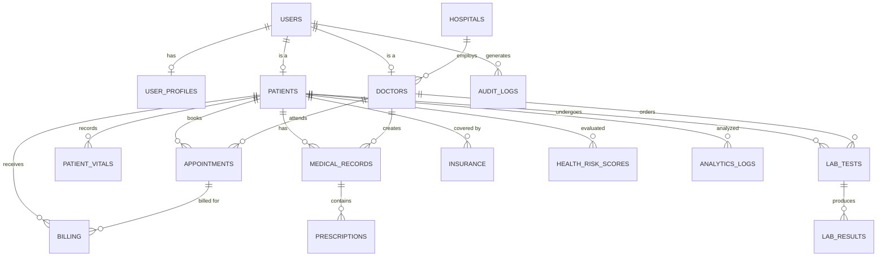

<br># 🏥 Healthcare Analytics — Complete Database Schema

> **Database&nbsp;:** `healthcare_analytics`
> **Engine&nbsp;&nbsp;:** MySQL
> **Tables&nbsp;&nbsp;:** 17

---

## 📑 Table of Contents

| # | Section | Tables |
|---|---------|--------|
| 1 | [Create Database](#step-1--create-database) | — |
| 2 | [Core Tables](#step-2--core-tables) | `users`, `hospitals` |
| 3 | [User-Related Tables](#step-3--user-related-tables) | `user_profiles`, `patients`, `doctors` |
| 4 | [Appointments Module](#step-4--appointments-module) | `appointments` |
| 5 | [Medical Data Tables](#step-5--medical-data-tables) | `patient_vitals`, `medical_records`, `prescriptions` |
| 6 | [Lab & Diagnostics](#step-6--lab--diagnostics) | `lab_tests`, `lab_results` |
| 7 | [Billing & Insurance](#step-7--billing--insurance) | `billing`, `insurance` |
| 8 | [Analytics & AI Tables](#step-8--analytics--ai-tables) | `health_risk_scores`, `analytics_logs` |
| 9 | [Audit Logs (Admin)](#step-9--audit-logs-admin) | `audit_logs` |
| ✅ | [Final Verification](#-final-verification) | — |

---

## 🗃️ Entity-Relationship Overview



---

## Step 1 — Create Database

```sql
-- ============================================================
-- 🏥 HEALTHCARE ANALYTICS DATABASE
-- Purpose : Central database for managing hospital operations,
--           patient records, billing, lab diagnostics, and
--           AI-driven health analytics.
-- ============================================================

CREATE DATABASE healthcare_analytics;   -- Create the main database
USE healthcare_analytics;               -- Switch to it for all subsequent queries
```

---

## Step 2 — Core Tables

> These tables have **no foreign keys** and must be created first.

### 2.1 `users`

| Column | Type | Constraints |
|--------|------|-------------|
| `user_id` | `INT` | `AUTO_INCREMENT`, **PRIMARY KEY** |
| `email` | `VARCHAR(255)` | `UNIQUE`, `NOT NULL` |
| `password_hash` | `VARCHAR(255)` | `NOT NULL` |
| `role` | `ENUM('admin','doctor','patient','analyst')` | `NOT NULL` |
| `is_active` | `BOOLEAN` | `DEFAULT TRUE` |
| `created_at` | `DATETIME` | `DEFAULT CURRENT_TIMESTAMP` |

```sql
-- ────────────────────────────────────────────────────────────
-- TABLE: users
-- Purpose : Stores login credentials and role info for every
--           person who accesses the system (admins, doctors,
--           patients, and data analysts).
-- Note    : This is the root table — most other tables
--           reference it via foreign keys.
-- ────────────────────────────────────────────────────────────

CREATE TABLE users (
    user_id        INT AUTO_INCREMENT PRIMARY KEY,           -- Unique identifier for each user
    email          VARCHAR(255) UNIQUE NOT NULL,             -- Login email (must be unique)
    password_hash  VARCHAR(255) NOT NULL,                    -- Bcrypt / hashed password (never plain text)
    role           ENUM('admin', 'doctor', 'patient', 'analyst') NOT NULL,  -- Access-control role
    is_active      BOOLEAN DEFAULT TRUE,                     -- Soft-delete flag (FALSE = deactivated)
    created_at     DATETIME DEFAULT CURRENT_TIMESTAMP        -- Account creation timestamp
);
```

---

### 2.2 `hospitals`

| Column | Type | Constraints |
|--------|------|-------------|
| `hospital_id` | `INT` | `AUTO_INCREMENT`, **PRIMARY KEY** |
| `name` | `VARCHAR(255)` | `NOT NULL` |
| `city` | `VARCHAR(100)` | — |
| `hospital_type` | `ENUM('government','private')` | — |
| `total_beds` | `INT` | — |

```sql
-- ────────────────────────────────────────────────────────────
-- TABLE: hospitals
-- Purpose : Master list of hospitals / healthcare facilities.
--           Doctors are linked to a hospital via foreign key.
-- ────────────────────────────────────────────────────────────

CREATE TABLE hospitals (
    hospital_id   INT AUTO_INCREMENT PRIMARY KEY,            -- Unique hospital identifier
    name          VARCHAR(255) NOT NULL,                     -- Official hospital name
    city          VARCHAR(100),                              -- City where the hospital is located
    hospital_type ENUM('government', 'private'),             -- Ownership type
    total_beds    INT                                        -- Total bed capacity
);
```

---

## Step 3 — User-Related Tables

### 3.1 `user_profiles`

| Column | Type | Constraints |
|--------|------|-------------|
| `profile_id` | `INT` | `AUTO_INCREMENT`, **PRIMARY KEY** |
| `user_id` | `INT` | `NOT NULL`, **FK → `users`** |
| `first_name` | `VARCHAR(100)` | — |
| `last_name` | `VARCHAR(100)` | — |
| `phone` | `VARCHAR(20)` | — |
| `address` | `TEXT` | — |

```sql
-- ────────────────────────────────────────────────────────────
-- TABLE: user_profiles
-- Purpose : Extended personal details for any user.
--           Separated from `users` to keep auth data lean.
-- On Delete: CASCADE — deleting a user removes their profile.
-- ────────────────────────────────────────────────────────────

CREATE TABLE user_profiles (
    profile_id  INT AUTO_INCREMENT PRIMARY KEY,              -- Profile record ID
    user_id     INT NOT NULL,                                -- FK → users (one-to-one)
    first_name  VARCHAR(100),                                -- User's first name
    last_name   VARCHAR(100),                                -- User's last name
    phone       VARCHAR(20),                                 -- Contact phone number
    address     TEXT,                                        -- Full mailing / residential address
    FOREIGN KEY (user_id) REFERENCES users(user_id)
        ON DELETE CASCADE                                    -- Auto-remove profile when user is deleted
);
```

---

### 3.2 `patients`

| Column | Type | Constraints |
|--------|------|-------------|
| `patient_id` | `INT` | `AUTO_INCREMENT`, **PRIMARY KEY** |
| `user_id` | `INT` | `NOT NULL`, **FK → `users`** |
| `blood_group` | `VARCHAR(10)` | — |
| `allergies` | `TEXT` | — |
| `chronic_conditions` | `TEXT` | — |
| `created_at` | `DATETIME` | `DEFAULT CURRENT_TIMESTAMP` |

```sql
-- ────────────────────────────────────────────────────────────
-- TABLE: patients
-- Purpose : Medical identity of a user who is a patient.
--           Holds health-specific data (blood group,
--           allergies, chronic conditions).
-- On Delete: CASCADE — removing the user removes patient data.
-- ────────────────────────────────────────────────────────────

CREATE TABLE patients (
    patient_id         INT AUTO_INCREMENT PRIMARY KEY,       -- Unique patient identifier
    user_id            INT NOT NULL,                         -- FK → users (links patient to login account)
    blood_group        VARCHAR(10),                          -- e.g. A+, B-, O+, AB+
    allergies          TEXT,                                 -- Known drug / food allergies
    chronic_conditions TEXT,                                 -- Long-term conditions (diabetes, asthma, etc.)
    created_at         DATETIME DEFAULT CURRENT_TIMESTAMP,   -- When the patient record was created
    FOREIGN KEY (user_id) REFERENCES users(user_id)
        ON DELETE CASCADE                                    -- Cascade delete with user account
);
```

---

### 3.3 `doctors`

| Column | Type | Constraints |
|--------|------|-------------|
| `doctor_id` | `INT` | `AUTO_INCREMENT`, **PRIMARY KEY** |
| `user_id` | `INT` | `NOT NULL`, **FK → `users`** |
| `specialization` | `VARCHAR(100)` | — |
| `license_number` | `VARCHAR(50)` | `UNIQUE` |
| `experience_years` | `INT` | — |
| `hospital_id` | `INT` | **FK → `hospitals`** |

```sql
-- ────────────────────────────────────────────────────────────
-- TABLE: doctors
-- Purpose : Professional details of users who are doctors.
--           Each doctor is optionally linked to a hospital.
-- FKs     : user_id  → users      (CASCADE on delete)
--           hospital_id → hospitals
-- ────────────────────────────────────────────────────────────

CREATE TABLE doctors (
    doctor_id        INT AUTO_INCREMENT PRIMARY KEY,         -- Unique doctor identifier
    user_id          INT NOT NULL,                           -- FK → users (links doctor to login account)
    specialization   VARCHAR(100),                           -- e.g. Cardiology, Neurology
    license_number   VARCHAR(50) UNIQUE,                     -- Medical license (must be unique)
    experience_years INT,                                    -- Years of professional experience
    hospital_id      INT,                                    -- FK → hospitals (where the doctor practices)
    FOREIGN KEY (user_id) REFERENCES users(user_id)
        ON DELETE CASCADE,                                   -- Remove doctor record if user is deleted
    FOREIGN KEY (hospital_id) REFERENCES hospitals(hospital_id)  -- Links to the hospital master table
);
```

---

## Step 4 — Appointments Module

### `appointments`

| Column | Type | Constraints |
|--------|------|-------------|
| `appointment_id` | `INT` | `AUTO_INCREMENT`, **PRIMARY KEY** |
| `patient_id` | `INT` | `NOT NULL`, **FK → `patients`** |
| `doctor_id` | `INT` | `NOT NULL`, **FK → `doctors`** |
| `appointment_date` | `DATE` | — |
| `appointment_time` | `TIME` | — |
| `status` | `ENUM('scheduled','completed','cancelled')` | — |

```sql
-- ────────────────────────────────────────────────────────────
-- TABLE: appointments
-- Purpose : Tracks scheduled, completed, and cancelled
--           visits between a patient and a doctor.
-- FKs     : patient_id → patients
--           doctor_id  → doctors
-- ────────────────────────────────────────────────────────────

CREATE TABLE appointments (
    appointment_id   INT AUTO_INCREMENT PRIMARY KEY,         -- Unique appointment ID
    patient_id       INT NOT NULL,                           -- FK → patients (who booked the visit)
    doctor_id        INT NOT NULL,                           -- FK → doctors  (assigned physician)
    appointment_date DATE,                                   -- Date of the appointment
    appointment_time TIME,                                   -- Scheduled time slot
    status           ENUM('scheduled', 'completed', 'cancelled'),  -- Current appointment status
    FOREIGN KEY (patient_id) REFERENCES patients(patient_id),      -- Links to patient record
    FOREIGN KEY (doctor_id) REFERENCES doctors(doctor_id)          -- Links to doctor record
);
```

---

## Step 5 — Medical Data Tables

### 5.1 `patient_vitals`

| Column | Type | Constraints |
|--------|------|-------------|
| `vital_id` | `INT` | `AUTO_INCREMENT`, **PRIMARY KEY** |
| `patient_id` | `INT` | `NOT NULL`, **FK → `patients`** |
| `heart_rate` | `INT` | — |
| `blood_pressure` | `VARCHAR(20)` | — |
| `temperature` | `FLOAT` | — |
| `recorded_at` | `DATETIME` | `DEFAULT CURRENT_TIMESTAMP` |

```sql
-- ────────────────────────────────────────────────────────────
-- TABLE: patient_vitals
-- Purpose : Time-series health readings captured during
--           check-ups or IoT device syncs.
-- FK      : patient_id → patients
-- ────────────────────────────────────────────────────────────

CREATE TABLE patient_vitals (
    vital_id        INT AUTO_INCREMENT PRIMARY KEY,          -- Unique reading ID
    patient_id      INT NOT NULL,                            -- FK → patients (whose vitals these are)
    heart_rate      INT,                                     -- Beats per minute (BPM)
    blood_pressure  VARCHAR(20),                             -- Format: "120/80" (systolic/diastolic)
    temperature     FLOAT,                                   -- Body temperature in °F or °C
    recorded_at     DATETIME DEFAULT CURRENT_TIMESTAMP,      -- When the reading was taken
    FOREIGN KEY (patient_id) REFERENCES patients(patient_id) -- Links to the patient
);
```

---

### 5.2 `medical_records`

| Column | Type | Constraints |
|--------|------|-------------|
| `record_id` | `INT` | `AUTO_INCREMENT`, **PRIMARY KEY** |
| `patient_id` | `INT` | `NOT NULL`, **FK → `patients`** |
| `doctor_id` | `INT` | `NOT NULL`, **FK → `doctors`** |
| `diagnosis` | `TEXT` | — |
| `treatment_plan` | `TEXT` | — |
| `record_date` | `DATE` | — |

```sql
-- ────────────────────────────────────────────────────────────
-- TABLE: medical_records
-- Purpose : Core clinical records — each row represents one
--           visit / consultation where a doctor diagnosed
--           a patient and outlined a treatment plan.
-- FKs     : patient_id → patients
--           doctor_id  → doctors
-- ────────────────────────────────────────────────────────────

CREATE TABLE medical_records (
    record_id       INT AUTO_INCREMENT PRIMARY KEY,          -- Unique record ID
    patient_id      INT NOT NULL,                            -- FK → patients (who was examined)
    doctor_id       INT NOT NULL,                            -- FK → doctors  (who examined)
    diagnosis       TEXT,                                    -- Doctor's diagnosis summary
    treatment_plan  TEXT,                                    -- Prescribed treatment & follow-up plan
    record_date     DATE,                                    -- Date of the consultation
    FOREIGN KEY (patient_id) REFERENCES patients(patient_id),
    FOREIGN KEY (doctor_id) REFERENCES doctors(doctor_id)
);
```

---

### 5.3 `prescriptions`

| Column | Type | Constraints |
|--------|------|-------------|
| `prescription_id` | `INT` | `AUTO_INCREMENT`, **PRIMARY KEY** |
| `record_id` | `INT` | `NOT NULL`, **FK → `medical_records`** |
| `medicine_name` | `VARCHAR(255)` | — |
| `dosage` | `VARCHAR(100)` | — |
| `duration` | `VARCHAR(100)` | — |

```sql
-- ────────────────────────────────────────────────────────────
-- TABLE: prescriptions
-- Purpose : Medicines prescribed as part of a medical record.
--           One medical_record can have multiple prescriptions.
-- On Delete: CASCADE — if the parent record is deleted,
--           all associated prescriptions are removed too.
-- ────────────────────────────────────────────────────────────

CREATE TABLE prescriptions (
    prescription_id INT AUTO_INCREMENT PRIMARY KEY,          -- Unique prescription ID
    record_id       INT NOT NULL,                            -- FK → medical_records (parent consultation)
    medicine_name   VARCHAR(255),                            -- Name of the prescribed medicine
    dosage          VARCHAR(100),                            -- e.g. "500mg twice daily"
    duration        VARCHAR(100),                            -- e.g. "7 days", "2 weeks"
    FOREIGN KEY (record_id) REFERENCES medical_records(record_id)
        ON DELETE CASCADE                                    -- Auto-remove if medical record is deleted
);
```

---

## Step 6 — Lab & Diagnostics

### 6.1 `lab_tests`

| Column | Type | Constraints |
|--------|------|-------------|
| `test_id` | `INT` | `AUTO_INCREMENT`, **PRIMARY KEY** |
| `patient_id` | `INT` | `NOT NULL`, **FK → `patients`** |
| `doctor_id` | `INT` | `NOT NULL`, **FK → `doctors`** |
| `test_name` | `VARCHAR(255)` | — |
| `test_date` | `DATE` | — |
| `status` | `ENUM('pending','completed')` | — |

```sql
-- ────────────────────────────────────────────────────────────
-- TABLE: lab_tests
-- Purpose : Tracks laboratory tests ordered by a doctor
--           for a patient (e.g. CBC, lipid panel, X-ray).
-- FKs     : patient_id → patients
--           doctor_id  → doctors
-- ────────────────────────────────────────────────────────────

CREATE TABLE lab_tests (
    test_id     INT AUTO_INCREMENT PRIMARY KEY,              -- Unique test ID
    patient_id  INT NOT NULL,                                -- FK → patients (who the test is for)
    doctor_id   INT NOT NULL,                                -- FK → doctors  (who ordered the test)
    test_name   VARCHAR(255),                                -- e.g. "Complete Blood Count (CBC)"
    test_date   DATE,                                        -- Date the test was / will be conducted
    status      ENUM('pending', 'completed'),                -- Whether results are available yet
    FOREIGN KEY (patient_id) REFERENCES patients(patient_id),
    FOREIGN KEY (doctor_id) REFERENCES doctors(doctor_id)
);
```

---

### 6.2 `lab_results`

| Column | Type | Constraints |
|--------|------|-------------|
| `result_id` | `INT` | `AUTO_INCREMENT`, **PRIMARY KEY** |
| `test_id` | `INT` | `NOT NULL`, **FK → `lab_tests`** |
| `parameter_name` | `VARCHAR(255)` | — |
| `result_value` | `VARCHAR(100)` | — |
| `normal_range` | `VARCHAR(100)` | — |

```sql
-- ────────────────────────────────────────────────────────────
-- TABLE: lab_results
-- Purpose : Individual result parameters for a completed
--           lab test (a single test may have many parameters).
-- Example : Test "CBC" → parameters: Hemoglobin, WBC, RBC…
-- On Delete: CASCADE — results removed when parent test is.
-- ────────────────────────────────────────────────────────────

CREATE TABLE lab_results (
    result_id       INT AUTO_INCREMENT PRIMARY KEY,          -- Unique result row ID
    test_id         INT NOT NULL,                            -- FK → lab_tests (parent test)
    parameter_name  VARCHAR(255),                            -- e.g. "Hemoglobin", "WBC Count"
    result_value    VARCHAR(100),                            -- Measured value (e.g. "14.5 g/dL")
    normal_range    VARCHAR(100),                            -- Reference range (e.g. "13.0–17.5 g/dL")
    FOREIGN KEY (test_id) REFERENCES lab_tests(test_id)
        ON DELETE CASCADE                                    -- Cascade delete with parent test
);
```

---

## Step 7 — Billing & Insurance

### 7.1 `billing`

| Column | Type | Constraints |
|--------|------|-------------|
| `bill_id` | `INT` | `AUTO_INCREMENT`, **PRIMARY KEY** |
| `patient_id` | `INT` | `NOT NULL`, **FK → `patients`** |
| `appointment_id` | `INT` | `NOT NULL`, **FK → `appointments`** |
| `total_amount` | `FLOAT` | — |
| `payment_status` | `ENUM('paid','unpaid','pending')` | — |
| `billing_date` | `DATE` | — |

```sql
-- ────────────────────────────────────────────────────────────
-- TABLE: billing
-- Purpose : Financial record for each appointment.
--           Tracks how much is owed and payment status.
-- FKs     : patient_id     → patients
--           appointment_id → appointments
-- ────────────────────────────────────────────────────────────

CREATE TABLE billing (
    bill_id         INT AUTO_INCREMENT PRIMARY KEY,          -- Unique bill ID
    patient_id      INT NOT NULL,                            -- FK → patients (who is being billed)
    appointment_id  INT NOT NULL,                            -- FK → appointments (what visit this is for)
    total_amount    FLOAT,                                   -- Total bill amount (in local currency)
    payment_status  ENUM('paid', 'unpaid', 'pending'),       -- Current payment state
    billing_date    DATE,                                    -- Date the bill was generated
    FOREIGN KEY (patient_id) REFERENCES patients(patient_id),
    FOREIGN KEY (appointment_id) REFERENCES appointments(appointment_id)
);
```

---

### 7.2 `insurance`

| Column | Type | Constraints |
|--------|------|-------------|
| `insurance_id` | `INT` | `AUTO_INCREMENT`, **PRIMARY KEY** |
| `patient_id` | `INT` | `NOT NULL`, **FK → `patients`** |
| `provider_name` | `VARCHAR(255)` | — |
| `policy_number` | `VARCHAR(100)` | — |
| `coverage_percentage` | `FLOAT` | — |

```sql
-- ────────────────────────────────────────────────────────────
-- TABLE: insurance
-- Purpose : Insurance policy details linked to a patient.
--           Used to calculate how much of a bill is covered.
-- FK      : patient_id → patients
-- ────────────────────────────────────────────────────────────

CREATE TABLE insurance (
    insurance_id        INT AUTO_INCREMENT PRIMARY KEY,      -- Unique insurance record ID
    patient_id          INT NOT NULL,                        -- FK → patients (policy holder)
    provider_name       VARCHAR(255),                        -- Insurance company name
    policy_number       VARCHAR(100),                        -- Policy / member ID
    coverage_percentage FLOAT,                               -- % of bill covered (e.g. 80.0 = 80%)
    FOREIGN KEY (patient_id) REFERENCES patients(patient_id) -- Links to the patient
);
```

---

## Step 8 — Analytics & AI Tables

### 8.1 `health_risk_scores`

| Column | Type | Constraints |
|--------|------|-------------|
| `risk_id` | `INT` | `AUTO_INCREMENT`, **PRIMARY KEY** |
| `patient_id` | `INT` | `NOT NULL`, **FK → `patients`** |
| `risk_type` | `VARCHAR(100)` | — |
| `risk_score` | `FLOAT` | — |
| `generated_at` | `DATETIME` | `DEFAULT CURRENT_TIMESTAMP` |

```sql
-- ────────────────────────────────────────────────────────────
-- TABLE: health_risk_scores
-- Purpose : AI/ML-generated risk assessments for patients.
--           e.g. "Diabetes Risk = 0.73" — used by analysts
--           and doctors for preventive care decisions.
-- FK      : patient_id → patients
-- ────────────────────────────────────────────────────────────

CREATE TABLE health_risk_scores (
    risk_id       INT AUTO_INCREMENT PRIMARY KEY,            -- Unique risk record ID
    patient_id    INT NOT NULL,                              -- FK → patients (who was evaluated)
    risk_type     VARCHAR(100),                              -- e.g. "Heart Disease", "Diabetes"
    risk_score    FLOAT,                                     -- Probability score (0.0 – 1.0)
    generated_at  DATETIME DEFAULT CURRENT_TIMESTAMP,        -- When the model generated this score
    FOREIGN KEY (patient_id) REFERENCES patients(patient_id) -- Links to the patient
);
```

---

### 8.2 `analytics_logs`

| Column | Type | Constraints |
|--------|------|-------------|
| `log_id` | `INT` | `AUTO_INCREMENT`, **PRIMARY KEY** |
| `patient_id` | `INT` | `NOT NULL`, **FK → `patients`** |
| `analysis_type` | `VARCHAR(255)` | — |
| `model_used` | `VARCHAR(255)` | — |
| `created_at` | `DATETIME` | `DEFAULT CURRENT_TIMESTAMP` |

```sql
-- ────────────────────────────────────────────────────────────
-- TABLE: analytics_logs
-- Purpose : Audit trail for every AI/ML analysis run on a
--           patient's data — useful for reproducibility,
--           debugging models, and compliance.
-- FK      : patient_id → patients
-- ────────────────────────────────────────────────────────────

CREATE TABLE analytics_logs (
    log_id          INT AUTO_INCREMENT PRIMARY KEY,          -- Unique log entry ID
    patient_id      INT NOT NULL,                            -- FK → patients (whose data was analyzed)
    analysis_type   VARCHAR(255),                            -- e.g. "Risk Prediction", "Readmission Forecast"
    model_used      VARCHAR(255),                            -- e.g. "XGBoost v2.1", "Logistic Regression"
    created_at      DATETIME DEFAULT CURRENT_TIMESTAMP,      -- Timestamp of the analysis run
    FOREIGN KEY (patient_id) REFERENCES patients(patient_id) -- Links to the patient
);
```

---

## Step 9 — Audit Logs (Admin)

### `audit_logs`

| Column | Type | Constraints |
|--------|------|-------------|
| `log_id` | `INT` | `AUTO_INCREMENT`, **PRIMARY KEY** |
| `user_id` | `INT` | `NOT NULL`, **FK → `users`** |
| `action` | `VARCHAR(255)` | — |
| `table_name` | `VARCHAR(100)` | — |
| `timestamp` | `DATETIME` | `DEFAULT CURRENT_TIMESTAMP` |

```sql
-- ────────────────────────────────────────────────────────────
-- TABLE: audit_logs
-- Purpose : Security & compliance log — records every
--           significant action (INSERT, UPDATE, DELETE)
--           performed by any user in the system.
-- FK      : user_id → users
-- ────────────────────────────────────────────────────────────

CREATE TABLE audit_logs (
    log_id      INT AUTO_INCREMENT PRIMARY KEY,              -- Unique log entry ID
    user_id     INT NOT NULL,                                -- FK → users (who performed the action)
    action      VARCHAR(255),                                -- e.g. "INSERT", "UPDATE", "DELETE"
    table_name  VARCHAR(100),                                -- Which table was affected
    timestamp   DATETIME DEFAULT CURRENT_TIMESTAMP,          -- When the action occurred
    FOREIGN KEY (user_id) REFERENCES users(user_id)          -- Links to the acting user
);
```

---

## ✅ Final Verification

Run the following query to confirm all **17 tables** were created successfully:

```sql
-- Quick verification query — should return exactly 17 table names
SHOW TABLES;
```

**Expected output — 17 tables:**

| # | Table Name |
|---|------------|
| 1 | `analytics_logs` |
| 2 | `appointments` |
| 3 | `audit_logs` |
| 4 | `billing` |
| 5 | `doctors` |
| 6 | `health_risk_scores` |
| 7 | `hospitals` |
| 8 | `insurance` |
| 9 | `lab_results` |
| 10 | `lab_tests` |
| 11 | `medical_records` |
| 12 | `patient_vitals` |
| 13 | `patients` |
| 14 | `prescriptions` |
| 15 | `user_profiles` |
| 16 | `users` |
| 17 | `audit_logs` |

---

> **✨ Schema created successfully — You're all set!**
