<div align="center">

# 🏥 Healthcare Analytics Database Management System

### A Comprehensive DBMS for Hospital Operations, Patient Records, Billing & AI-Driven Health Analytics


---

**👥 Team Members**

| Name | Role |
|------|------|
| **Umar Iqbal** | Team Member |
| **Gufran Ali** | Team Member |
| **SaiKrishna Paila** | Team Member |
| **Yuvraj Viplav** | Team Member |

</div>

---

## 📑 Table of Contents

- [Project Overview](#-project-overview)
- [Objectives](#-objectives)
- [System Architecture](#-system-architecture)
- [ER Diagrams](#-er-diagrams)
- [Database Schema](#-database-schema)
- [Table Descriptions](#-table-descriptions)
- [Relationships & Constraints](#-relationships--constraints)
- [Modules Overview](#-modules-overview)
- [Setup & Installation](#-setup--installation)
- [Project Structure](#-project-structure)
- [Technologies Used](#-technologies-used)
- [Future Enhancements](#-future-enhancements)

---

## 📖 Project Overview

The **Healthcare Analytics Database Management System** is a relational database designed to model and manage the complete ecosystem of a modern healthcare facility. It captures everything from **user authentication** and **patient profiles** to **appointments**, **medical records**, **lab diagnostics**, **billing & insurance**, and even **AI-driven health risk analytics**.

This project demonstrates advanced database design concepts including:

- ✅ **Normalization** (up to 3NF) to eliminate data redundancy
- ✅ **Referential Integrity** via carefully planned foreign key constraints
- ✅ **Role-Based Access Control (RBAC)** through user roles (`admin`, `doctor`, `patient`, `analyst`)
- ✅ **Cascade Operations** for maintaining data consistency on deletions
- ✅ **Audit Logging** for security compliance and traceability
- ✅ **Modular Design** with clearly separated functional domains

---

## 🎯 Objectives

| # | Objective | Description |
|---|-----------|-------------|
| 1 | **Centralized Data Management** | Store and manage all healthcare data in a single, well-structured relational database |
| 2 | **Patient Lifecycle Tracking** | Track patients from registration through appointments, diagnoses, prescriptions, and billing |
| 3 | **Doctor & Hospital Management** | Maintain professional details of doctors and link them to their affiliated hospitals |
| 4 | **Lab & Diagnostics Integration** | Record lab tests ordered, their results, and reference ranges for clinical use |
| 5 | **Financial Management** | Handle billing per appointment with payment status tracking and insurance coverage |
| 6 | **AI/ML Analytics Support** | Provide structured tables for storing AI-generated health risk scores and model run logs |
| 7 | **Security & Compliance** | Implement audit logs recording every significant action performed in the system |

---

## 🏗️ System Architecture

The database follows a **modular layered architecture**, logically grouped into functional domains:

```
┌──────────────────────────────────────────────────────────────────┐
│                    HEALTHCARE ANALYTICS DB                        │
├──────────────────────────────────────────────────────────────────┤
│                                                                  │
│  ┌─────────────┐    ┌──────────────────┐    ┌────────────────┐  │
│  │   AUTH &     │    │   CLINICAL       │    │  ANALYTICS     │  │
│  │   IDENTITY   │    │   MODULE         │    │  & AI          │  │
│  │             │    │                  │    │                │  │
│  │ • users     │───▶│ • appointments   │    │ • health_risk  │  │
│  │ • profiles  │    │ • medical_records│───▶│   _scores      │  │
│  │ • patients  │───▶│ • prescriptions  │    │ • analytics    │  │
│  │ • doctors   │───▶│ • patient_vitals │    │   _logs        │  │
│  └─────────────┘    └──────────────────┘    └────────────────┘  │
│         │                    │                                   │
│         │           ┌───────┴────────┐                          │
│         │           │  LAB &         │    ┌────────────────┐   │
│         │           │  DIAGNOSTICS   │    │  ADMIN &       │   │
│  ┌──────┴──────┐    │                │    │  SECURITY      │   │
│  │ HOSPITAL    │    │ • lab_tests    │    │                │   │
│  │ MANAGEMENT  │    │ • lab_results  │    │ • audit_logs   │   │
│  │             │    └────────────────┘    └────────────────┘   │
│  │ • hospitals │                                               │
│  └─────────────┘    ┌────────────────┐                         │
│                     │  BILLING &     │                         │
│                     │  INSURANCE     │                         │
│                     │                │                         │
│                     │ • billing      │                         │
│                     │ • insurance    │                         │
│                     └────────────────┘                         │
│                                                                  │
└──────────────────────────────────────────────────────────────────┘
```

---

## 📊 ER Diagrams

### Complete Entity-Relationship Diagram

The following ER diagram illustrates the complete schema with all **17 tables**, their attributes, primary keys, and foreign key relationships:


---

### Patient Billing Ecosystem

This focused diagram highlights the interconnected flow between patients, appointments, billing, and insurance — the financial backbone of the system:


---

## 🗄️ Database Schema

### Schema Overview

| # | Table Name | Module | Description |
|---|-----------|--------|-------------|
| 1 | `users` | Auth & Identity | Login credentials & role assignment |
| 2 | `user_profiles` | Auth & Identity | Extended personal details (name, phone, address) |
| 3 | `patients` | Auth & Identity | Patient-specific medical identity |
| 4 | `doctors` | Auth & Identity | Doctor professional details & hospital affiliation |
| 5 | `hospitals` | Hospital Mgmt | Master list of healthcare facilities |
| 6 | `appointments` | Clinical | Scheduled visits between patients and doctors |
| 7 | `patient_vitals` | Clinical | Time-series health readings (BP, heart rate, temp) |
| 8 | `medical_records` | Clinical | Diagnosis and treatment plans per consultation |
| 9 | `prescriptions` | Clinical | Medicines prescribed per medical record |
| 10 | `lab_tests` | Lab & Diagnostics | Lab tests ordered by doctors |
| 11 | `lab_results` | Lab & Diagnostics | Individual result parameters per test |
| 12 | `billing` | Billing & Insurance | Financial records per appointment |
| 13 | `insurance` | Billing & Insurance | Patient insurance policy details |
| 14 | `health_risk_scores` | Analytics & AI | AI-generated risk assessments |
| 15 | `analytics_logs` | Analytics & AI | Audit trail of ML model runs |
| 16 | `audit_logs` | Admin & Security | System-wide action logging |

---

## 📋 Table Descriptions

### 🔐 Module 1: Auth & Identity

#### `users`
The **root table** of the entire system. Every person (admin, doctor, patient, or analyst) must have a user account to access the platform.

| Column | Type | Key | Description |
|--------|------|-----|-------------|
| `user_id` | INT | PK | Auto-increment unique ID |
| `email` | VARCHAR(255) | UQ | Login email address |
| `password_hash` | VARCHAR(255) | | Hashed password (never stored in plain text) |
| `role` | ENUM | | `admin` · `doctor` · `patient` · `analyst` |
| `is_active` | BOOLEAN | | Soft-delete flag (`TRUE` = active) |
| `created_at` | DATETIME | | Account creation timestamp |

#### `user_profiles`
Extended personal info, kept separate from `users` to maintain a lean authentication table.

| Column | Type | Key | Description |
|--------|------|-----|-------------|
| `profile_id` | INT | PK | Auto-increment unique ID |
| `user_id` | INT | FK → `users` | One-to-one link to user account |
| `first_name` | VARCHAR(100) | | User's first name |
| `last_name` | VARCHAR(100) | | User's last name |
| `phone` | VARCHAR(20) | | Contact number |
| `address` | TEXT | | Full residential address |

#### `patients`
Medical identity for users with the `patient` role. Stores health-specific attributes.

| Column | Type | Key | Description |
|--------|------|-----|-------------|
| `patient_id` | INT | PK | Auto-increment unique ID |
| `user_id` | INT | FK → `users` | Links to the patient's login account |
| `blood_group` | VARCHAR(10) | | e.g., A+, B−, O+, AB+ |
| `allergies` | TEXT | | Known drug / food allergies |
| `chronic_conditions` | TEXT | | Long-term conditions (diabetes, asthma, etc.) |
| `created_at` | DATETIME | | Record creation timestamp |

#### `doctors`
Professional details for users with the `doctor` role, optionally affiliated with a hospital.

| Column | Type | Key | Description |
|--------|------|-----|-------------|
| `doctor_id` | INT | PK | Auto-increment unique ID |
| `user_id` | INT | FK → `users` | Links to the doctor's login account |
| `specialization` | VARCHAR(100) | | e.g., Cardiology, Neurology |
| `license_number` | VARCHAR(50) | UQ | Unique medical license number |
| `experience_years` | INT | | Years of professional experience |
| `hospital_id` | INT | FK → `hospitals` | Affiliated hospital |

---

### 🏥 Module 2: Hospital Management

#### `hospitals`
Master directory of all healthcare facilities. **No foreign keys** — this is a standalone reference table.

| Column | Type | Key | Description |
|--------|------|-----|-------------|
| `hospital_id` | INT | PK | Auto-increment unique ID |
| `name` | VARCHAR(255) | | Official hospital name |
| `city` | VARCHAR(100) | | City location |
| `hospital_type` | ENUM | | `government` · `private` |
| `total_beds` | INT | | Total bed capacity |

---

### 📅 Module 3: Clinical

#### `appointments`
Every patient visit is recorded here, linking a patient to a doctor on a specific date/time.

| Column | Type | Key | Description |
|--------|------|-----|-------------|
| `appointment_id` | INT | PK | Auto-increment unique ID |
| `patient_id` | INT | FK → `patients` | Who booked the visit |
| `doctor_id` | INT | FK → `doctors` | Assigned physician |
| `appointment_date` | DATE | | Appointment date |
| `appointment_time` | TIME | | Scheduled time slot |
| `status` | ENUM | | `scheduled` · `completed` · `cancelled` |

#### `patient_vitals`
Time-series health readings captured during check-ups or synced from IoT devices.

| Column | Type | Key | Description |
|--------|------|-----|-------------|
| `vital_id` | INT | PK | Auto-increment unique ID |
| `patient_id` | INT | FK → `patients` | Whose vitals |
| `heart_rate` | INT | | Beats per minute (BPM) |
| `blood_pressure` | VARCHAR(20) | | Format: `120/80` |
| `temperature` | FLOAT | | Body temperature |
| `recorded_at` | DATETIME | | Reading timestamp |

#### `medical_records`
Core clinical records — one row per consultation documenting diagnosis and treatment.

| Column | Type | Key | Description |
|--------|------|-----|-------------|
| `record_id` | INT | PK | Auto-increment unique ID |
| `patient_id` | INT | FK → `patients` | Who was examined |
| `doctor_id` | INT | FK → `doctors` | Who examined |
| `diagnosis` | TEXT | | Diagnosis summary |
| `treatment_plan` | TEXT | | Treatment & follow-up plan |
| `record_date` | DATE | | Date of consultation |

#### `prescriptions`
Medicines prescribed as part of a medical record. One record can have multiple prescriptions.

| Column | Type | Key | Description |
|--------|------|-----|-------------|
| `prescription_id` | INT | PK | Auto-increment unique ID |
| `record_id` | INT | FK → `medical_records` | Parent consultation |
| `medicine_name` | VARCHAR(255) | | Prescribed medicine |
| `dosage` | VARCHAR(100) | | e.g., "500mg twice daily" |
| `duration` | VARCHAR(100) | | e.g., "7 days" |

---

### 🔬 Module 4: Lab & Diagnostics

#### `lab_tests`
Tracks lab tests ordered by doctors. Each test progresses from `pending` → `completed`.

| Column | Type | Key | Description |
|--------|------|-----|-------------|
| `test_id` | INT | PK | Auto-increment unique ID |
| `patient_id` | INT | FK → `patients` | Who the test is for |
| `doctor_id` | INT | FK → `doctors` | Who ordered it |
| `test_name` | VARCHAR(255) | | e.g., "Complete Blood Count (CBC)" |
| `test_date` | DATE | | Date of test |
| `status` | ENUM | | `pending` · `completed` |

#### `lab_results`
Individual result parameters for a completed test. One test can produce multiple result rows.

| Column | Type | Key | Description |
|--------|------|-----|-------------|
| `result_id` | INT | PK | Auto-increment unique ID |
| `test_id` | INT | FK → `lab_tests` | Parent test |
| `parameter_name` | VARCHAR(255) | | e.g., "Hemoglobin" |
| `result_value` | VARCHAR(100) | | Measured value |
| `normal_range` | VARCHAR(100) | | Reference range |

---

### 💳 Module 5: Billing & Insurance

#### `billing`
Financial record generated for each appointment. Tracks the total amount and payment status.

| Column | Type | Key | Description |
|--------|------|-----|-------------|
| `bill_id` | INT | PK | Auto-increment unique ID |
| `patient_id` | INT | FK → `patients` | Who is being billed |
| `appointment_id` | INT | FK → `appointments` | Which visit |
| `total_amount` | FLOAT | | Bill amount |
| `payment_status` | ENUM | | `paid` · `unpaid` · `pending` |
| `billing_date` | DATE | | Date of bill generation |

#### `insurance`
Insurance policy details for a patient, used to calculate coverage on bills.

| Column | Type | Key | Description |
|--------|------|-----|-------------|
| `insurance_id` | INT | PK | Auto-increment unique ID |
| `patient_id` | INT | FK → `patients` | Policy holder |
| `provider_name` | VARCHAR(255) | | Insurance company |
| `policy_number` | VARCHAR(100) | | Policy / member ID |
| `coverage_percentage` | FLOAT | | % of bill covered |

---

### 🤖 Module 6: Analytics & AI

#### `health_risk_scores`
AI/ML-generated risk assessments used for preventive care decisions.

| Column | Type | Key | Description |
|--------|------|-----|-------------|
| `risk_id` | INT | PK | Auto-increment unique ID |
| `patient_id` | INT | FK → `patients` | Who was evaluated |
| `risk_type` | VARCHAR(100) | | e.g., "Heart Disease", "Diabetes" |
| `risk_score` | FLOAT | | Probability (0.0 – 1.0) |
| `generated_at` | DATETIME | | Model generation timestamp |

#### `analytics_logs`
Audit trail for every ML analysis run — ensures reproducibility and compliance.

| Column | Type | Key | Description |
|--------|------|-----|-------------|
| `log_id` | INT | PK | Auto-increment unique ID |
| `patient_id` | INT | FK → `patients` | Whose data was analyzed |
| `analysis_type` | VARCHAR(255) | | e.g., "Risk Prediction" |
| `model_used` | VARCHAR(255) | | e.g., "XGBoost v2.1" |
| `created_at` | DATETIME | | Analysis run timestamp |

---

### 🛡️ Module 7: Admin & Security

#### `audit_logs`
Records every significant action (INSERT, UPDATE, DELETE) performed in the system for security and compliance.

| Column | Type | Key | Description |
|--------|------|-----|-------------|
| `log_id` | INT | PK | Auto-increment unique ID |
| `user_id` | INT | FK → `users` | Who performed the action |
| `action` | VARCHAR(255) | | e.g., "INSERT", "UPDATE" |
| `table_name` | VARCHAR(100) | | Which table was affected |
| `timestamp` | DATETIME | | When the action occurred |

---

## 🔗 Relationships & Constraints

### Foreign Key Map

```
users ──────────┬──────────── user_profiles    (1:1, CASCADE)
                ├──────────── patients          (1:1, CASCADE)
                ├──────────── doctors           (1:1, CASCADE)
                └──────────── audit_logs        (1:N)

hospitals ──────────────────── doctors           (1:N)

patients ───────┬──────────── appointments      (1:N)
                ├──────────── patient_vitals    (1:N)
                ├──────────── medical_records   (1:N)
                ├──────────── lab_tests         (1:N)
                ├──────────── billing           (1:N)
                ├──────────── insurance         (1:N)
                ├──────────── health_risk_scores(1:N)
                └──────────── analytics_logs    (1:N)

doctors ────────┬──────────── appointments      (1:N)
                ├──────────── medical_records   (1:N)
                └──────────── lab_tests         (1:N)

medical_records ────────────── prescriptions     (1:N, CASCADE)
lab_tests ──────────────────── lab_results       (1:N, CASCADE)
appointments ───────────────── billing           (1:N)
```

### Cascade Delete Rules

| Parent Table | Child Table | On Delete |
|-------------|-------------|-----------|
| `users` | `user_profiles` | **CASCADE** — profile removed with user |
| `users` | `patients` | **CASCADE** — patient data removed with user |
| `users` | `doctors` | **CASCADE** — doctor record removed with user |
| `medical_records` | `prescriptions` | **CASCADE** — prescriptions removed with record |
| `lab_tests` | `lab_results` | **CASCADE** — results removed with test |

---

## 🧩 Modules Overview

```mermaid
graph LR
    A[🔐 Auth & Identity] --> B[📅 Clinical Module]
    A --> C[🏥 Hospital Mgmt]
    B --> D[🔬 Lab & Diagnostics]
    B --> E[💳 Billing & Insurance]
    B --> F[🤖 Analytics & AI]
    A --> G[🛡️ Admin & Security]

    style A fill:#4F46E5,color:#fff,stroke:none
    style B fill:#0891B2,color:#fff,stroke:none
    style C fill:#059669,color:#fff,stroke:none
    style D fill:#7C3AED,color:#fff,stroke:none
    style E fill:#DC2626,color:#fff,stroke:none
    style F fill:#EA580C,color:#fff,stroke:none
    style G fill:#64748B,color:#fff,stroke:none
```



| Module | Tables | Purpose |
|--------|--------|---------|
| 🔐 **Auth & Identity** | `users`, `user_profiles`, `patients`, `doctors` | User management, authentication, and role-based profiles |
| 🏥 **Hospital Mgmt** | `hospitals` | Master directory of healthcare facilities |
| 📅 **Clinical** | `appointments`, `patient_vitals`, `medical_records`, `prescriptions` | Core patient care workflow |
| 🔬 **Lab & Diagnostics** | `lab_tests`, `lab_results` | Laboratory test ordering and result management |
| 💳 **Billing & Insurance** | `billing`, `insurance` | Financial operations and insurance coverage |
| 🤖 **Analytics & AI** | `health_risk_scores`, `analytics_logs` | Machine learning model outputs and audit trails |
| 🛡️ **Admin & Security** | `audit_logs` | System-wide action logging for compliance |

---

## ⚙️ Setup & Installation

### Prerequisites

- **MySQL** 8.0 or higher
- A MySQL client (MySQL Workbench, DBeaver, phpMyAdmin, or CLI)

### Quick Start

1. **Clone the repository**
   ```bash
   git clone <repository-url>
   cd DBMS-Project
   ```

2. **Open your MySQL client** and connect to your server

3. **Run the complete schema script**
   ```sql
   -- Execute the file:
   SOURCE Database Queries/Complete_Database_Queries.md
   ```
   
   Or copy and paste the SQL statements from [`Complete_Database_Queries.md`](Database%20Queries/Complete_Database_Queries.md) into your MySQL client.

4. **Verify installation**
   ```sql
   USE healthcare_analytics;
   SHOW TABLES;
   -- You should see 17 tables ✅
   ```

---

## 📁 Project Structure

```
DBMS Project/
│
├── 📄 README.md                          ← You are here
│
├── 📂 Database Queries/
│   ├── Complete_Database_Queries.md      ← Full SQL schema with comments
│   └── Complete_Database_Quesries.md     ← Original raw queries
│
└── 📂 Project Resources/
    ├── ER Diagram Simple.png             ← Complete ER diagram
    └── Patient Billing Ecosystem-*.png   ← Billing ecosystem diagram
```

---

## 🛠️ Technologies Used

| Technology | Purpose |
|-----------|---------|
| **MySQL 8.0** | Relational Database Management System |
| **SQL (DDL)** | Data Definition Language for schema creation |
| **ER Modeling** | Entity-Relationship diagrams for visual design |
| **Markdown** | Project documentation |

---

## 🚀 Future Enhancements

| # | Enhancement | Description |
|---|------------|-------------|
| 1 | **Stored Procedures** | Automate common workflows (e.g., booking an appointment + creating a bill) |
| 2 | **Triggers** | Auto-populate `audit_logs` on INSERT/UPDATE/DELETE across tables |
| 3 | **Views** | Pre-built views for doctor dashboards, patient history, revenue reports |
| 4 | **Indexing** | Add composite indexes on frequently queried columns for performance |
| 5 | **Data Seeding** | Sample data scripts for testing and demonstration |
| 6 | **Frontend Integration** | Connect the database to a web application (Node.js / Python Flask) |
| 7 | **Role-Based Access** | Implement MySQL user roles matching the ENUM roles in the `users` table |

---

<div align="center">

### ⭐ Made with dedication by

**Umar Iqbal** · **Gufran Ali** · **SaiKrishna Paila** · **Yuvraj Viplav**

---

*Healthcare Analytics DBMS — Database Management Systems Project, 2026*

</div>
# DBMS-PROJECT-2CSE12


